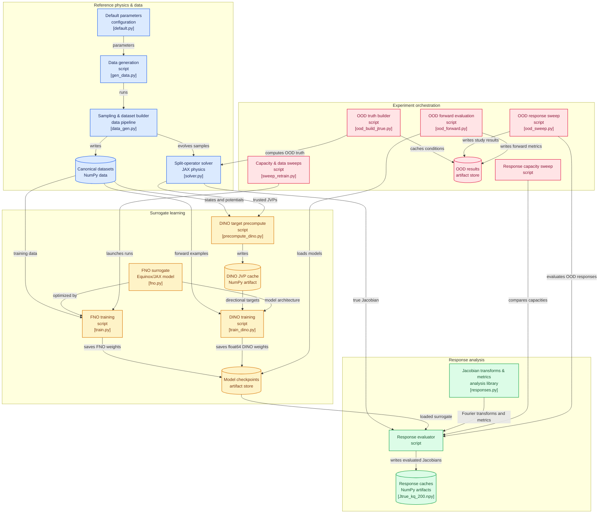

# Derivative-Informed Fourier Neural Operators for learning Quantum Response Functions

## Purpose and entry points
This is a Python/JAX research pipeline for learning 1D periodic time-dependent Schrödinger evolution, then measuring whether a Fourier Neural Operator (FNO) learns the potential-to-wavefunction response Jacobian as a byproduct. Primary drivers are data generation, FNO/DINO training, response evaluation, and experiment sweeps: `scripts/gen_data.py`, `scripts/train.py`, `scripts/train_dino.py`, `scripts/compute_response.py`, and `scripts/eval_ood.py`.

## Reference physics and data pipeline
The trusted reference map is split-operator/Strang evolution on a periodic ring, with FFT kinetic steps and real-space potential kicks. It is differentiated through JAX `lax.scan` to make long-horizon Jacobians tractable. Core boundary: physics/data uses float64; learned-model training historically uses float32, while DINO runs in float64 due to JVP targets.
- Solver: `src/solver.py`
- Sampling and fine-grid/subsampled dataset construction: `src/data_gen.py`, `scripts/gen_data.py`
- Default experiment parameters: `configs/default.py`

Inputs are wrapped Gaussian initial wavepackets plus smooth random Fourier potentials; outputs are final complex wavefunctions stored as split real/imaginary arrays. The canonical dataset is generated at high resolution then subsampled, avoiding coarse-solve/upscale artifacts.

## FNO surrogate
The FNO approximates `(psi0, V) -> psiT` using four real input channels—real/imaginary wavefunction, potential, grid—and two real output channels. Spectral convolution is hand-built with Equinox/JAX; `n_modes` is the central capacity dial. Training owns data loading, complex recombination, optimization, metrics, checkpoint naming, and MLflow logging.
- Model: `src/fno.py`
- Forward training harness: `scripts/train.py`
- Stored model artifacts: `checkpoints/`

Checkpoint filenames encode model family, train-set size, seed, mode count, derivative weight, and epoch. This naming/provenance is essential because evaluation loaders must distinguish float32-origin FNO weights from native float64 DINO checkpoints.

## Response/Jacobian evaluation
The project compares `J_true = d psiT / dV` from the solver against `J_fno` from the surrogate, holding `psi0` fixed and differentiating only with respect to real-valued potential samples. Full Jacobians are materialized in position space and rotated to `(k,q)` Fourier mode-coupling space. Relative Frobenius error, scale ratio, alignment, and optimal real rescaling separate magnitude from directional failure.
- Jacobian, transforms, and metrics: `src/responses.py`
- Main evaluator: `scripts/compute_response.py`
- Cached evaluations: `results/Jtrue_kq_200.npy`, `results/Jfno_kq_seed0_M16.npy`

This is the main scientific boundary: endpoint forward accuracy does not guarantee correct local sensitivity. The true solver is the source of derivative truth; trained models never call it at inference.

## Derivative-informed training (DINO)
DINO adds a JVP-matching loss to forward loss. Instead of full Jacobians per batch, offline preprocessing creates isotropic potential directions and trusted solver `J_true v` targets; training samples one direction per example. This changes expensive solver differentiation into lookup-backed supervision.
- DINO trainer: `scripts/train_dino.py`
- Precompute builder: `scripts/precompute_dino.py`
- Target cache: `results/dino_precompute.npz`

The derivative term has configurable strength and warmup. Its role is to constrain otherwise forward-equivalent models toward the true linearization, improving both response and forward metrics.

## Experimental orchestration and artifacts
Scripts implement capacity, seed, training-size, perturbation-theory, alignment, and OOD studies. OOD potentials reuse stored Fourier coefficients, reweight spectral length scale, and cache `J_true` per OOD condition for reuse across models.
- OOD build/evaluation: `scripts/ood_build_jtrue.py`, `scripts/ood_sweep.py`, `scripts/ood_forward.py`
- Capacity/data sweeps: `scripts/sweep_retrain.py`, `scripts/sweep_response_vs_n.py`
- Results: `results/`, including `results/ood/`

## Runtime and infrastructure
Runtime is Python with JAX/XLA, Equinox model pytrees/checkpoint serialization, Optax optimization, NumPy artifacts, MLflow tracking, and Matplotlib analysis. Local experiment state includes `mlflow.db`, `logs/`, `checkpoints/`, and `results/`; no service-oriented or web runtime is indicated.

## Pipeline overview

</explanation>

---
## References
* **Derivative-Informed Fourier Neural Operator: Universal Approximation and Applications to PDE-Constrained Optimization**, Boyuan Yao, Dingcheng Luo, Lianghao Cao, Nikola Kovachki, Thomas O'Leary-Roseberry, Omar Ghattas. (2025). [arXiv: 2512.14086](https://arxiv.org/abs/2512.14086).
* **Derivative-informed neural operator acceleration of geometric MCMC for infinite-dimensional Bayesian inverse problems**, Lianghao Cao, Thomas O'Leary-Roseberry, Omar Ghattas. (2024). [arXiv: 2403.08220](https://arxiv.org/abs/2403.08220).
* **Derivative-Informed Operator Learning for Finance: On-the-Fly Greeks, Surfaces, Hedging, and Control**, Miquel Noguer I Alonso. (2026). [arXiv: 2606.05900](https://arxiv.org/abs/2606.05900).
* **Fourier Neural Operators for Learning Dynamics in Quantum Spin Systems**, Freya Shah, Taylor L. Patti, Julius Berner, Bahareh Tolooshams, Jean Kossaifi, Anima Anandkumar. (2024). [arXiv: 2409.03302](https://arxiv.org/abs/2409.03302).
* **The Propagator and the Path Integral**, Robert G. Littlejohn. (2021). [Notes](https://bohr.physics.berkeley.edu/classes/221/notes/pathint.pdf).
* **Introduction to Quantum Mechanics**, David Griffiths. (1995).
* **A particle on a ring or: how I learned to stop worrying and love θ-vacua**, Mohammad Aghaie, Ryosuke Sato. (2026). [arXiv: 2601.18248v1)](https://arxiv.org/abs/2601.18248v1).
* **Physical Chemistry for the Life Sciences**, Julio de Paula, Peter Atkins. (2006).
* **Time Evolution Split Operator Method**, Christina C. Lee. (2021). [Here](https://albi3ro.github.io/M4/Time-Evolution.html).
* **Exploring the Propagator of a Particle in a Box**, S. A. Fulling, K. S. Güntürk. [Here](https://people.tamu.edu/~fulling/box/box.pdf#:~:text=Here%20we%20take%20a%20close,wave%20function.).
* **Path Integral for a Particle in a Box**, A. Hershman. (1994). [Here](https://www.cds.caltech.edu/~marsden/wiki/uploads/projects/geomech/Hershman1994.pdf).
* **Path Integrals and Their Application to Dissipative Quantum Systems**, Gert-Ludwig Ingold. (2002). [arXiv: 0208026](https://arxiv.org/abs/quant-ph/0208026).
* **Spectral Neural Operators**, V. Fanaskov, I. Oseledets. (2022). [arXiv: 2205.10573](https://arxiv.org/abs/2205.10573).
* **Toward a Better Understanding of Fourier Neural Operators: Analysis and Improvement from a Spectral Perspective**, Shaoxiang Qin, Fuyuan Lyu, Wenhui Peng, Dingyang Geng, Ju Wang, Naiping Gao, Xue Liu, Liangzhu Leon Wang. (2024). [arXiv: 2404.07200](https://arxiv.org/abs/2404.07200v1).
* **Fourier Neural Operators Explained: A Practical Perspective**, Valentin Duruisseaux, Jean Kossaifi, Anima Anandkumar. (2024). [arXiv: 2512.01421](https://arxiv.org/abs/2512.01421).
* **Spectral Methods for Partial Differential Equations**, David Chopp. (2008). [Notes](https://people.esam.northwestern.edu/~chopp/course_notes/446-2.pdf).
* **LNO: Laplace Neural Operator for Solving Differential Equations**, Qianying Cao, Somdatta Goswami, George Em Karniadakis. (2023). [arXiv: 2303.10528](https://arxiv.org/abs/2303.10528).
* **A Library for Learning Neural Operators**, Jean Kossaifi, Nikola Kovachki, Zongyi Li, David Pitt, Miguel Liu-Schiaffini, Robert Joseph George, Boris Bonev, Kamyar Azizzadenesheli, Julius Berner, Valentin Duruisseaux, Anima Anandkumar. (2024). [arXiv: 2412.10354](https://arxiv.org/abs/2412.10354).
* **Neural Operator: Learning Maps Between Function Spaces**, Nikola Kovachki, Zongyi Li, Burigede Liu, Kamyar Azizzadenesheli, Kaushik Bhattacharya, Andrew Stuart, Anima Anandkumar. (2021). [arXiv: 2108.08481](https://arxiv.org/abs/2108.08481).
* **Redefining Neural Operators in d+1 Dimensions**, Haoze Song, Zhihao Li, Xiaobo Zhang, Zecheng Gan, Zhilu Lai, Wei Wang. (2025). [arXiv: 2505.11766v1](https://arxiv.org/abs/2505.11766v1).
* **Equinox: neural networks in JAX via callable PyTrees and filtered transformations**, Patrick Kidger, Cristian Garcia. (2021). [arXiv: 2111.00254](https://arxiv.org/abs/2111.00254).
* **Neural Operators: FNO and DeepONet**. [Watch here](https://www.youtube.com/watch?v=COEItKEZ-is).
* **Fourier Neural Operator for Parametric Partial Differential Equations**, Zongyi Li, Nikola Kovachki, Kamyar Azizzadenesheli, Burigede Liu, Kaushik Bhattacharya, Andrew Stuart, Anima Anandkumar. (2020). [arXiv: 2010.08895](https://arxiv.org/abs/2010.08895).
* **How a Fourier Neural Operator Learns to Solve PDEs — and Where It Falls Short**, Gurpreet Singh Hora, Prakhar Kapoor, Albert Matveev. (2026). [Here](https://www.physicsx.ai/newsroom/how-a-fourier-neural-operator-learns-to-solve-pdes----and-where-it-falls-short).

